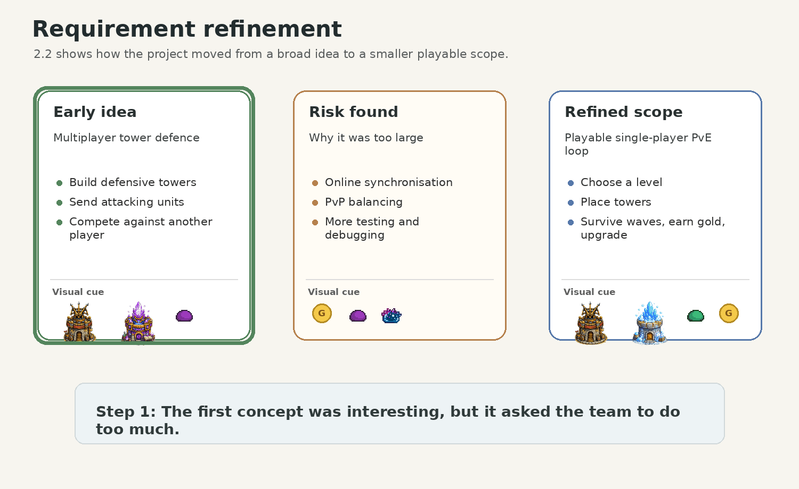
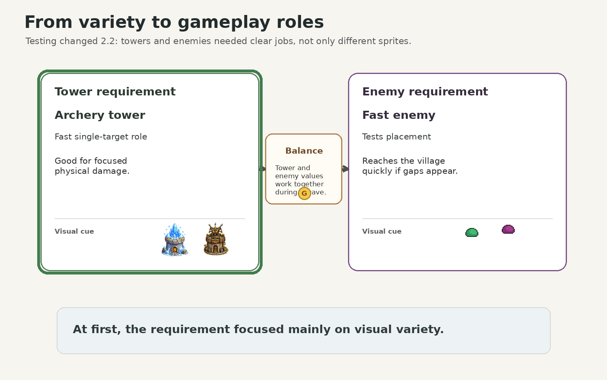
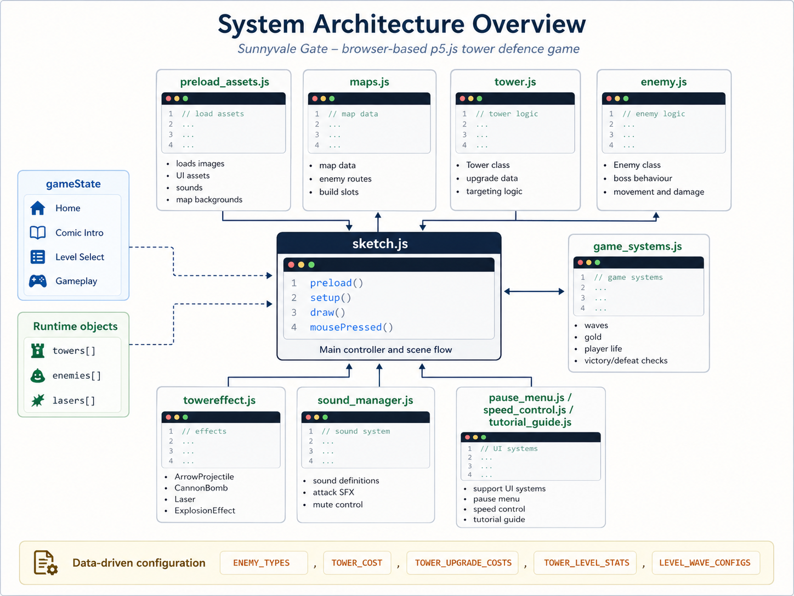
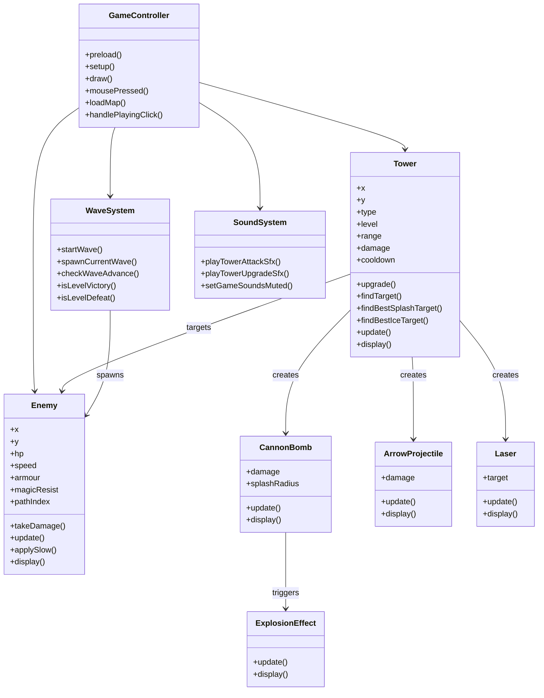

# 2026-group-11

## Sunnyvale Gate

Love the art style of Stardew Valley and enjoy playing Kingdom Rush? Then this game is tailor-made for you — through spring, summer, autumn, and winter, protect your village in every season!

[Click here to play the game](https://uob-comsm0166.github.io/2026-group-11/)

VIDEO. Include a demo video of your game here

# Table of Contents
1. [Team](#team)
2. [Introduction](#introduction)
3. [Requirements](#requirements)
4. [Design](#design)
5. [Implementation](#implementation)
6. [Evaluation](#evaluation)
7. [Process](#process)
8. [Sustainability, Ethics and Accessibility](#sustainability-ethics-and-accessibility)
9. [Conclusion](#conclusion)
10. [Contribution Statement](#contribution-statement)
11. [AI Statement](#ai-statement)

# Team

| # | Name | Email | Role |
|:-:|------|-------|------|
| 1 | Yi Lin | adai08823@gmail.com | Developer & Game Designer |
| 2 | Chuhang Li | zgndylch@163.com | Developer & Game Designer |
| 3 | Yuxuan Cheng | chengyx0921@outlook.com | Developer & Graphic Artist |
| 4 | Wen Liang | fd21102@bristol.ac.uk | Report & Process Coordinator |
| 5 | Zishen Xu | chuichisum@163.com | Coder & Report |

# Introduction

**Sunnyvale Gate** is a browser-based tower defence game developed with p5.js. The concept was inspired by two games that several members of our group enjoyed: *Stardew Valley* and *Kingdom Rush*. We wanted to draw on the warm seasonal style of *Stardew Valley*, while combining it with the clearer goals and strategic gameplay of a tower defence game.

In the game, the player protects a village from waves of slime enemies across four seasonal maps: spring, summer, autumn and winter. The player earns gold by defeating enemies, then uses it to build or upgrade towers. Different enemies have different health, speed and resistance values, so the player needs to decide which towers to build and when to upgrade them.

Our main twist is that the game uses a cosy farming-game atmosphere while adding more specialised tower behaviours. For example, the Frost Tower slows enemies that have not already been slowed, while the Cannon Tower attacks areas where enemies are most concentrated. The final level also includes a boss with special behaviours, including splitting, reviving and attacking the player’s most valuable tower. These features became the main technical challenges during implementation.

## Defensive Towers

| Tower Type | Image | Description |
|------------|-------|-------------|
| 
<strong>Archery Tower</strong> Level 1
 |  | This is the cheapest offensive tower, costing **70 gold**. It deals **10 physical damage** every **30 frames** within a **400 range**, so it is useful for setting up the first line of defence without spending too many resources. |
| 
<strong>Archery Tower</strong> Level 2
 |  | The first upgrade costs **110 gold** and makes the tower noticeably faster. Its range increases to **500**, its damage rises to **15**, and it attacks every **20 frames**, which helps it deal with stronger enemies in the early and middle stages. |
| 
<strong>Archery Tower</strong> Level 3
 |  | At Level 3, the Archery Tower becomes a fast single-target damage source. It reaches **600 range**, attacks every **10 frames**, and deals **20 physical damage**, making it useful when the player needs steady damage against enemies with low physical resistance. |
| 
<strong>Magic Tower</strong> Level 1
 |  | The Magic Tower costs **100 gold** and starts with **25 magic damage**, a **400 range**, and a **45-frame** attack interval. It gives the player an early option against enemies that are harder to defeat with physical attacks. |
| 
<strong>Magic Tower</strong> Level 2
 |  | After spending **160 gold** on the upgrade, the tower improves to **40 magic damage**, **450 range**, and a **40-frame** attack interval. This makes it a more dependable counter to enemies with strong physical defence. |
| 
<strong>Magic Tower</strong> Level 3
 |  | The final upgrade costs **240 gold** and raises the tower to **60 magic damage** with **500 range**. Although it attacks more slowly than the Archery Tower, its higher magic damage makes it valuable against armoured enemies. |
| 
<strong>Cannon Tower</strong> Level 1
 |  | The Cannon Tower is the most expensive basic tower, costing **125 gold**, but it can damage groups from the start. It deals **35 damage** every **65 frames** and uses a **100 splash radius**, which makes it useful when enemies move close together. |
| 
<strong>Cannon Tower</strong> Level 2
 |  | This upgrade costs **220 gold** and improves both damage and coverage. The tower deals **55 area damage**, reaches **440 range**, and expands its splash radius to **125**, giving the player a stronger answer to larger ground waves. |
| 
<strong>Cannon Tower</strong> Level 3
 |  | Once fully upgraded, the Cannon Tower deals **80 area damage** with a **150 splash radius** and **480 range**. It is especially useful on narrow parts of the map, where several enemies can be hit by one attack. |
| 
<strong>Ice Tower</strong> Level 1
 |  | The Ice Tower costs **70 gold** and is mainly a support tower rather than a damage tower. It only deals **5 magic damage**, but it slows enemies to **50% speed** for **70 frames**, giving nearby damage towers more time to attack. |
| 
<strong>Ice Tower</strong> Level 2
 |  | For **110 gold**, this upgrade extends the tower’s range to **500** and strengthens the slow effect. Enemies are reduced to **40% speed** for **90 frames**, which makes this level useful when faster enemies start to appear. |
| 
<strong>Ice Tower</strong> Level 3
 |  | At Level 3, the Ice Tower becomes the strongest control tower in the game. It reaches **600 range**, attacks every **25 frames**, and slows enemies to **30% speed** for **120 frames**, helping the defence stay stable during difficult waves. |

## Enemies

| Monster Type | Image | Description |
|--------------|-------|-------------|
| Baby Slime |  | A small split enemy with only **35 HP** but **speed 4.0**, so it is weak on its own but can still be dangerous when several appear together. |
| Black Slime |  | With **180 HP** and **armour 0.75**, the Black Slime is harder to remove with basic physical damage than the early slime enemies. |
| Crime Slime |  | This is one of the tougher slime enemies, with **1000 HP** and a **50 gold reward**. It is used as a high-value target in later waves. |
| Dungeon Slime |  | The Dungeon Slime has **600 HP** and gives **40 gold** when defeated, so it takes longer to kill but also rewards the player well. |
| Green Slime |  | The Green Slime is the basic enemy type, with **40 HP**, **speed 2.0**, and a small **4 gold reward**. It introduces the main combat loop. |
| Mother Slime |  | The Mother Slime has **220 HP** and can **split into four Baby Slimes** after death, which means the threat continues even after the main body is defeated. |
| Purple Slime |  | With **70 HP** and **speed 4.0**, the Purple Slime is not very durable, but it can move through weak defences quickly. |
| Red Slime |  | The Red Slime has **50 HP** and **speed 3.0**, making it a simple but faster enemy that tests early tower placement. |
| Glow Slime |  | The Glow Slime has **400 HP** and **magicResist 0.5**, so magic attacks are less effective against it than physical or cannon damage. |
| Gold Slime |  | The Gold Slime has **260 HP** and gives **12 gold** when defeated, making it useful for giving the player more upgrade resources. |
| Ice Spike Slime |  | Because it has **400 HP** and **armour 0.25**, physical attacks are much weaker against it. Magic towers are usually the better choice. |
| Crystal Slime |  | The Crystal Slime also has **400 HP**, but its key feature is **magicResist 0.25**, which makes magic damage much less effective. |
| Rainbow Slime |  | Slow but difficult to kill, the Rainbow Slime has **2000 HP** and a high **80 gold reward**. It works as a late-game endurance enemy. |
| King Slime |  | The King Slime is the final boss, with **6000 HP**, a **150 gold reward**, and special behaviours such as **splitting**, **reviving**, and **targeting the most valuable tower**. |
| Gastropod |  | The Gastropod is a flying enemy with **110 HP**, **speed 3.5**, and **canFly enabled**, so it adds pressure in a different way from ground slimes. |
| Spectral Gastropod |  | The Spectral Gastropod is a stronger flying enemy, with **180 HP** and **speed 3.0**. It appears later to increase air-path pressure. |

# Requirements

## 2.1 Early stages design

At the start of the project, we compared several game ideas in online meetings. The two ideas we returned to most were a rhythm game and a tower defence game. We chose tower defence because it gave us a clear structure: enemies follow a path, the player places towers, and each level ends with a clear win or loss.

Our first plan was bigger than the final game. Around week three, we wanted to make a multiplayer tower defence game, where players could build defensive towers and send attacking units. We explored this idea with a PowerPoint prototype and some paper sketches.

https://github.com/user-attachments/assets/f44697fe-5f10-425b-bfe4-ec8478d52890

  <strong>Figure 1: Early prototype video used to discuss the original multiplayer tower defence idea.</strong>

The prototype made the risk much easier to see. Multiplayer would have required **online synchronisation**, PvP balancing and more testing before the basic tower defence loop was even stable. Since our group had limited game development experience, we reduced the scope and moved to a single-player PvE game inspired by *Kingdom Rush*.

## 2.2 Requirement elicitation and refinement

After reducing the scope, we focused on what one match should contain. The player needed to choose a level, place towers on **valid positions**, survive **enemy waves**, earn **gold**, upgrade towers and protect the village.

We used *Kingdom Rush* as a reference, but not as something to copy directly. It helped us check whether our game included the features players would expect from a tower defence game: **visible enemy paths**, fixed building points, upgrades, resources and clear win-or-lose feedback. We built the basic parts first, such as map loading, enemy movement, tower placement, tower attacks, health, gold and level completion. Features such as sound effects, tutorial guidance, special tower behaviour and the boss were added later.

  

  <strong>Figure 2: Requirement refinement from the early multiplayer idea to the single-player PvE loop.</strong>

Testing also changed our thinking. At first, different tower images seemed enough to show variety. In practice, this did not give the player many real choices. Each tower needed a clear role: archery for fast single-target damage, magic for enemies with physical defence, cannon for grouped enemies and ice for slowing enemies. We used the same idea for enemies by giving them different **health**, **speed**, **resistance** and **gold reward** values.

  

  <strong>Figure 3: Refining tower and enemy requirements into gameplay roles.</strong>

## 2.3 Stakeholders

Following the requirements lecture, we identified stakeholders before writing user stories. The most important stakeholders were the **players**. They needed to understand the path, tower positions, **health**, **gold** and level results without guessing what was happening.

The **development team** was another important stakeholder. The project had to fit our skills and the time available, which is why we removed multiplayer and used adjustable map, tower and wave data instead.

Other groups also affected the requirements. Designers cared about balance and level pacing. Artists cared about seasonal style and readability. Testers needed clear checks, such as whether towers attacked enemies in range or whether gold was deducted after an upgrade.

  

  <strong>Figure 4: Stakeholder diagram for Sunnyvale Gate.</strong>

## 2.4 Epics, User Stories and Acceptance Criteria

**Epic E1: Core PvE Tower Defence Loop**

- **US1.1 – Player**: As a player, I want to defend my village from enemy waves, so that the level becomes more challenging over time.
  - **Acceptance Criteria**: Given that a level has loaded and enemies have spawned, when an enemy enters tower range, then the tower attacks a valid target.

- **US1.2 – Player**: As a player, I want to upgrade towers, so that I can handle stronger enemies.
  - **Acceptance Criteria**: Given that the player has enough **gold** and selects a tower, when the upgrade is confirmed, then gold is deducted and the tower statistics change.

- **US1.3 – Player**: As a player, I want clear defeat feedback, so that I know when the village has been lost.
  - **Acceptance Criteria**: Given that enemies are moving along the path, when an enemy reaches the village, then **health** decreases. If health reaches zero, then the defeat screen appears.

**Epic E2: Content and Balance**

- **US2.1 – Developer**: As a developer, I want adjustable values, so that damage, range, speed, resistance and rewards can be balanced.
  - **Acceptance Criteria**: Given that tower or enemy data has been changed, when the level is loaded, then the game uses the new values.

- **US2.2 – Game Designer**: As a game designer, I want configurable waves, so that maps can have different pacing and enemy combinations.
  - **Acceptance Criteria**: Given that wave data has been edited, when a level starts, then enemies spawn according to that data.

**Epic E3: Combat Feedback and Readability**

- **US3.1 – Player**: As a player, I want attack effects and sounds, so that I can see whether towers are working.
  - **Acceptance Criteria**: Given that an enemy is in range, when a tower attacks, then the game shows an attack effect and plays a sound.

- **US3.2 – Player**: As a player, I want **health**, **gold**, towers and enemies to be readable, so that I can make decisions quickly during a wave.
  - **Acceptance Criteria**: Given that the player is in a level, when they look at the game screen, then health, gold, towers and enemy movement are visible without opening another menu.

## 2.5 Use Case Diagram

The use case diagram summarises the player’s main actions: start the game, select a level, place and upgrade towers, pause, and reach victory or defeat. It also reminded us that player actions often need system checks, such as **valid placement**, enough **gold** and village **health**.

  

  <strong>Figure 5: Use case diagram showing the main player interactions in Sunnyvale Gate.</strong>

## 2.6 Reflection

Requirements work made the project more realistic. It helped us move from a broad idea to a game we could actually finish.

The user stories made us think less like developers and more like players. A tower was not finished just because it appeared on the map. It needed valid placement, cost, attacks and feedback. This made the requirements useful during testing, not just during planning.

We also learned that requirements change once the game becomes playable. Tower balance, enemy difficulty and interface clarity all changed during development, but having the requirements written down made those changes easier to discuss.

# Design

## 3.1 System Architecture

**Sunnyvale Gate** was designed as a browser-based p5.js game that runs from the `docs` folder on GitHub Pages. We kept the overall structure simple because the project needed to be playable in the browser, and because our group was still learning JavaScript and p5.js while building the game.

The main file is `sketch.js`, which acts as the central controller. It uses the p5.js lifecycle functions `preload()`, `setup()`, `draw()` and `mousePressed()` to load assets, create the canvas, update the game every frame and handle player input. A global `gameState` variable controls the main scene flow, including the home screen, comic introduction, level selection and gameplay. This gave the game a clear player journey without needing a more complicated screen management system.

Several design choices came directly from the requirements in Section 2. For example, the requirements for **enemy waves**, **tower upgrades**, **gold**, and **valid tower placement** meant that the game needed data that could be changed easily. For this reason, map data is stored in `maps.js`, enemy values are stored in `ENEMY_TYPES`, and tower values are stored in `TOWER_COST`, `TOWER_UPGRADE_COSTS` and `TOWER_LEVEL_STATS`. Wave patterns are defined in `LEVEL_WAVE_CONFIGS`. This data-driven approach made balancing easier, since we could adjust health, damage, range or wave timing without rewriting the whole battle system.

  

  <strong>Figure 6: System architecture overview of Sunnyvale Gate.</strong>

During a level, active objects are stored in arrays such as `towers`, `enemies` and `lasers`. Each frame, the game updates enemy movement, tower targeting, projectiles, visual effects, player gold, village health and win-or-lose checks. This fits p5.js well because the `draw()` loop already works as a repeated update cycle.

We also separated key responsibilities across different files. `preload_assets.js` handles asset loading, `maps.js` stores map layouts and build slots, `tower.js` manages tower behaviour and upgrade values, and `enemy.js` handles enemy movement and boss behaviour. In addition, `game_systems.js` manages waves, gold, player life and victory or defeat checks, while `towereffect.js` handles combat effects such as arrows, lasers, cannon bombs and explosions. Other supporting systems, including sound, pause control, speed control and tutorial guidance, are placed in separate files. This made the project easier to develop in parallel, even though `sketch.js` still became larger than we originally expected.

## 3.2 Class Diagram

The class diagram below summarises the main static structure of the game. It is based on the actual code rather than an ideal design only. Some parts, such as `Tower` and `Enemy`, are implemented as classes in the project. Others, like wave management and sound control, are closer to modules or controller-style responsibilities. We kept them in the diagram because they still play an important role in how the game is organised.

The most central gameplay class is `Tower`, defined in `tower.js`. It stores information such as position, tower type, level, range, damage and cooldown. More importantly, it also handles behaviour. A tower can upgrade itself, search for enemies, choose different targets depending on its type, and attack when the cooldown allows it. Since our four main tower types behave differently, putting this logic inside the class made the code easier to follow.

`Enemy`, defined in `enemy.js`, is the main class on the other side of combat. It stores movement, health, resistances and path progress, but it also includes behaviour such as taking damage, updating position and applying slow effects. In our game, enemy behaviour is not completely uniform. Boss enemies add more complex logic, including special movement and abilities, so the `Enemy` class ended up carrying both ordinary enemy behaviour and boss-related extensions.

The combat effect classes are grouped in `towereffect.js`. These include `ArrowProjectile`, `Laser`, `CannonBomb`, and several short-lived effect classes such as `ExplosionEffect`, `ArrowHitEffect`, `MagicHitEffect`, `TowerUpgradeEffect` and `TowerSellEffect`. These objects are temporary. They are created during battle, shown for a short period, and then removed. Separating them from `Tower` and `Enemy` helped keep combat feedback more readable.

Functions in `game_systems.js` manage wave progression, enemy spawning and victory or defeat checks. Strictly speaking, this part is more procedural than object-oriented, but in the diagram it is still useful to show it as a system-level component because towers and enemies both depend on the larger game flow. The same applies to sound and scene control: they are not the heart of combat, but they support the overall architecture.

This design is not highly abstract, and that was intentional. For a browser game built with p5.js, a flatter structure suited the project better than a complicated inheritance hierarchy. It was easier to debug, easier to extend, and easier for the whole group to understand.

  <strong>Figure 7: Class diagram showing the main classes, modules and relationships in Sunnyvale Gate.</strong>

## 3.3 Behavioural Diagram

The behavioural diagram shows the main flow of the game from the player’s point of view. The player starts on the home screen, enters the comic introduction, selects a level, and then moves into gameplay. This follows the same `gameState` structure described in the system architecture.

  

  <strong>Figure 8: Sequence diagram showing the main gameplay flow.</strong>

Once a level starts, the system loads the selected map and begins the wave process. Player actions such as placing or upgrading towers are not only visual updates. The game also checks **valid tower slots**, available **gold**, and the current scene state before changing the active objects.

The diagram also helped us understand the repeated combat loop. Enemies spawn and move along the path, while towers search for targets and attack enemies in range. At the same time, the system updates projectiles, effects, player health and win-or-loss conditions. Even though these parts are split across different files in the code, they need to work together every frame.

Pause control is included because it interrupts this normal loop. When the pause menu opens, gameplay updates need to stop, but the menu itself still has to respond to player input. This showed us that scene control and gameplay logic are connected, not completely separate.

Overall, the behavioural diagram helped us check whether the design supported a full player journey, from opening the game to reaching victory or defeat.

## 3.4 Design Reflection

Overall, the design was simple but practical. Using p5.js meant that a repeated frame update was natural, so the `draw()` loop became a clear place to update enemies, towers, effects and game state. This matched the type of game we were building.

The strongest part of the design was the data-driven structure. Tower statistics, enemy values, map routes and wave configurations were stored separately from most of the gameplay logic. This made balancing easier after testing, because we could adjust values such as **damage**, **range**, **health**, **speed** and **spawn timing** without rewriting the whole system.

The modular file structure also helped the team work more clearly. For example, tower behaviour, enemy behaviour, wave control, sound and UI support were placed in different files. This made the project easier to understand than putting everything into one script.

The main weakness was that `sketch.js` still became too large by the end of the project. It handled scene switching, player input, UI actions and some gameplay control at the same time. If we continued development, we would split scene management and UI interaction into separate modules. This would make the central game loop easier to read and reduce the risk of small UI changes affecting unrelated gameplay logic.

# Implementation

- 15% ~750 words

- Describe implementation of your game, in particular highlighting the TWO areas of *technical challenge* in developing your game.

- 怎么完成整个游戏代码的

## Challenge 1： Different defense towers

### 1. The Ice Tower will prioritize attacking enemies who have not been slowed down
介绍代码，配图

### 2. The turret will select a position with the most enemies to deal damage to the range area
介绍代码，配图

## Challenge 2： Boss Design

### 1. When the boss dies, it splits into four pieces and reassembles itself after a short time to revive.
介绍代码，配图

### 2. The boss will search for the most expensive tower in the map for targeted attacks.
介绍代码，配图

# Evaluation

## Qualitative evaluation

### Think Aloud Evaluation
| Moment | Player Comment | Issue Identified |
|------|------|------|
| Game Start | “How do I place towers?” | Players aren’t aware of where to click to deploy towers |
| After selecting a unit | “What’s the difference between these towers?” | Tower types aren’t clearly explained |
| During gameplay | “How much health and gold do I have?” | The interface isn’t clear enough |

During the “think-aloud” evaluation, we identified several usability issues with the game. Participants initially struggled to understand how to deploy towers, likely due to the missing “Start Game” option and the lack of an introductory tutorial. The tower-building mechanics were also ambiguous, leaving players unsure whether they could interact with the towers. Furthermore, since the interface did not clearly explain the functions of each tower type and there was no tutorial, players struggled to understand the differences between them. Finally, players expressed confusion regarding the gold system because the display of gold held was unclear. Some players did not notice the health and gold counts displayed in the top-left corner until the game was nearly over.

## Heuristic Evaluation
| Interface | Issue | Heuristic | Frequency | Impact | Persistence | Severity |
|---|---|---|---|---|---|---|
| Game Start / Main Screen |The game starts immediately when the page loads, giving players no preparation time or option to start the game manually.| User Control and Freedom | 3 | 3 | 2 | 2.7 |
| Unit Representation |Four shapes are used to represent different unit types, but the introduction is unclear and the differences are not intuitive.| Recognition Rather Than Recall | 3 | 3 | 2 | 2.7 |
| Unit Information Display |Players cannot see the exact health or attack values of units, making it difficult to evaluate combat strength.| Visibility of System Status | 3 | 2 | 2 | 2.3 |
| Resource Display |The gold counter is displayed in the bottom-left corner and is not visually prominent.| Visibility of System Status | 2 | 2 | 1 | 1.7 |
| Combat Feedback |Units fighting each other have no visual effects, making battles less noticeable.| Visibility of System Status | 2 | 2 | 2 | 2.0 |

The results of the heuristic evaluation highlighted several usability issues, and we have prioritized design improvements. The most critical issues are those with the highest severity score (2.7), specifically the lack of a tutorial at the start of the game, which prevents users from getting off to a smooth start. We plan to address these issues first, as they directly impact the user’s initial experience and their ability to understand the core game mechanics. Medium-priority issues include a lack of clear unit information and insufficient combat feedback, which hinder players’ ability to make informed decisions and receive feedback during combat. Lower-priority issues, such as resource visibility being unclear, have a lesser impact on overall usability but still require improvements to enhance the overall experience.

## Quantitative Evaluation

### NASA TLX

| User | Difficulty 1 | Difficulty 2 |
|------|-------------|-------------|
| 1 | 35 | 72 |
| 2 | 58 | 65 |
| 3 | 41 | 78 |
| 4 | 63 | 70 | 
| 5 | 47 | 82 |
| 6 | 52 | 60 | 
| 7 | 29 | 67 |
| 8 | 61 | 75 | 
| 9 | 45 | 73 |
| 10 | 54 | 68 |

The NASA TLX test results presented in the table show the perceived workload of ten users across two difficulty levels of the game. Overall, the data indicates a clear trend of increased workload at difficulty level 2 compared to difficulty level 1. Most participants required greater mental effort when playing at difficulty level 2, and they also reported increased anxiety and frustration.

### SUS

| User | Difficulty 1 | Difficulty 2 |
|------|-------------|-------------|
| 1 | 52 | 40 |
| 2 | 55 | 45 |
| 3 | 50 | 38 |
| 4 | 53 | 42 |
| 5 | 48 | 35 |
| 6 | 58 | 47 |
| 7 | 54 | 50 |
| 8 | 49 | 37 |
| 9 | 51 | 41 |
| 10 | 53 | 44 |

The SUS results shown in the table indicate that the usability score has been consistently low at both difficulty levels, suggesting significant usability issues with the system. For difficulty level 1, most scores are between 48 and 58, mainly due to the unclear UI interface displaying health and coins, which creates a bad experience for players. For difficulty level 2, the score further decreases, with many values dropping between 35 and 45, reflecting that the increase in difficulty exacerbates existing usability issues.

## How code was tested

### White box
The white-box testing in this project focuses on the internal game logic instead of the visual interface. The test page resets the main game variables before each test, including enemies, towers, player gold, player life, wave indexes, spawn queues, and frame count. It then creates controlled objects, such as test paths, towers, and enemies, and directly calls the same methods used during gameplay. For example, it tests whether towers upgrade correctly depending on the current map, whether cannon towers ignore flying enemies, whether ice towers prioritise unslowed ground enemies, whether physical and magic resistance affect damage correctly, and whether split enemies create child enemies after death. It also checks the wave system by testing startWave() and spawnCurrentWave() to make sure enemies are added to the game at the correct time. This makes it possible to find logic errors in the core systems before testing the full game through normal player interaction.

### Black box
Throughout the development process, we have been conducting black box testing, focusing on interacting with the game from the player's perspective to verify if the functionality is working as expected. This method helped us identify and solve several key problems.
Firstly, the background image does not match the actual walkable path. Testers found that the area shown in the background image as a road differed from the walkable path by a certain distance, causing enemies to directly pass through terrain that was not suitable for walking. We have readjusted the collision and visual layers of each map to ensure that the enemy's path perfectly matches the visual background.
Secondly, there have been cases where testers clicked on the UI to build defense towers but nothing happened. After fixing the UI logic, all buttons reliably triggered the build and upgrade operations.
Thirdly, the game is unbalanced - monsters are too difficult to deal with. Feedback indicates that early enemies had excessively high health values; Even with correctly placed towers, it is difficult for players to kill them, which greatly damages the experience. Based on the test data, we adjusted the enemy's health and the damage of the defense tower to make the difficulty curve smoother, challenging but not discouraging.
Through this black box test, we not only verified the basic playability of the game, but also collected valuable player feedback. After each fix, we will rerun the relevant test cases to ensure that the issue is truly resolved and no new errors are introduced. This lays a solid foundation for providing stable and enjoyable tower defense games.

# Process 

## Collaboration
In the early stage of the project, Yi Lin, Chuhang Li, and Yuxuan Cheng collected many interesting game ideas, and shared game links and video references in a shared document for the whole team. They also analysed different game genres and listed several promising directions to explore. Meanwhile, Wen Liang and Zishen Xu implemented an initial playable prototype, using simple shapes to represent towers, enemies, and the village.

To give every team member an opportunity to work on code, we swapped roles in the middle of the project. From that point on, Yi Lin, Chuhang Li, and Yuxuan Cheng took primary responsibility for game development and helped document the code‑related parts of the report. Wen Liang and Zishen Xu focused on weekly workshop tasks and report writing, while also providing feedback, suggesting ideas, and assisting with game code when needed.

This role exchange worked well for us: it allowed everyone to understand both development and documentation, though we also learned that communication became more critical when responsibilities shifted.

## Tools
In the first week after forming the group, we exchanged contact details and created a WeChat group to facilitate communication. During the second week, when discussing initial game ideas, we held an online meeting via Zoom and used Feishu’s document-sharing function to collaboratively develop and refine our concepts in real time.

     

Throughout the project, we maintained frequent communication, with daily updates shared in the group chat to report progress and discuss ongoing changes. In addition to the weekly face-to-face meetings after Tuesday sessions, we organised online meetings for every two weeks to ensure that all team members remained aligned and were progressing in the right direction. After each meeting, one member was responsible for documenting key discussion points and recording areas for improvement in Feishu, allowing all members to stay informed and track development decisions.

We implemented a Kanban-style task management system within Feishu to organise and track our development progress. Tasks were categorised into stages such as “To Do”, “In Progress”, and “Done”, which helped improve visibility and coordination within the team.

This structured communication approach helped improve coordination and transparency within the team. By combining meetings and group chat and shared documents, we were able to respond quickly to issues and maintain consistent progress. However, there were occasional challenges in scheduling meetings due to conflicting timetables, which required flexibility and adjustment from all team members.

# Sustainability, ethics and accessibility

## Environmental
The direct impact of this game on the environment is relatively low because it is a lightweight digital application that does not require specialized hardware. However, like all software systems, it still consumes computing resources during execution, including CPU usage, memory, and power. If a large number of participants frequently use it, this may lead to an increase in energy consumption and related carbon emissions. In addition, there is a potential rebound effect that increasing participation in games may lead to longer screen time and higher overall device usage. To mitigate these impacts, games can be optimized for performance efficiency, such as reducing unnecessary computations and limiting resource intensive processes, which is consistent with sustainable software design principles.

## Social
From a societal perspective, games have the potential to encourage interaction and participation among players, especially when played in group environments. However, the relatively high difficulty of the game may pose obstacles for inexperienced users, reducing inclusivity and overall engagement. Players who struggle to understand the mechanisms or cope with challenges may feel frustrated or discouraged, which can have a negative impact on their willingness to continue playing or interacting with others. Therefore, games may not equally support a variety of players, which can affect accessibility and user satisfaction. To enhance social sustainability, it is important to balance challenges and usability by providing clearer explanations, more supportive feedback, and potentially adjustable difficulty levels to ensure a more inclusive experience.

## Individual 
Games have a significant impact on individuals, especially in terms of user experience, learning, and happiness. Although it can provide entertainment, the relatively high difficulty may lead to increased frustration and decreased satisfaction for some players. Users who strive for progress may feel discouraged, which can have a negative impact on motivation and overall enjoyment. This is consistent with the evaluation results, where as the difficulty increases, the workload increases, and the usability score decreases. In addition, prolonged exposure to a challenging and potentially frustrating system may lead to mental fatigue. To enhance individual sustainability, it is important to balance challenge and usability by providing clearer feedback, smoother learning curves, and potentially adjustable difficulty levels, ensuring that the game remains attractive without negatively impacting user interest.

# Conclusion
Developing our tower defence game challenged and improved our understanding of the full software development process. At the beginning of the project, we collected a range of possible game ideas and discussed their strengths, weaknesses, and feasibility. We then narrowed these ideas down into one clear tower defence concept, which allowed us to focus on a game that was both achievable within the deadline and enjoyable for players.

Using Agile-style planning also helped us organise the project more clearly. By writing epics, user stories, and acceptance criteria, we were able to break the game down into smaller features, such as placing towers, spawning enemies, upgrading towers, pausing the game, and completing levels. This made the development process easier to manage and gave us clearer goals for what each feature needed to achieve. Creating class diagrams and sequence diagrams also helped us understand how the main systems, such as towers, enemies, waves, projectiles, maps, and UI, should interact with each other.

Evaluation was another valuable part of the project. Qualitative Evaluation, including think-aloud testing and heuristic evaluation, helped us understand how real users experienced the game. These methods revealed issues such as unclear feedback, confusing controls, and areas where players needed more guidance. Quantitative Evaluation, including SUS and NASA-TLX, gave us measurable feedback about usability and workload, which helped support our design decisions with evidence rather than personal opinion.

We also learnt the value of both black-box and white-box testing. Black-box testing allowed us to check whether the game behaved correctly from the player’s perspective, while white-box testing helped us test the internal logic directly, such as tower upgrades, enemy damage, slowing effects, split enemies, and wave spawning. This made debugging more efficient and helped us find problems that were not always obvious during normal gameplay.

Looking forward, there are several improvements we would make to the current game. We would improve the save and continue system, polish the user interface, add clearer gameplay feedback, and continue balancing the difficulty of each level. If we had the opportunity to develop a sequel, we would add more tower types, enemies with special abilities, and more complex maps with branching paths or environmental effects.  Finally, considering sustainability encouraged us to think about performance, maintainability, accessibility, and how the project could continue to develop beyond the current version. Overall, this project gave us valuable experience in teamwork, planning, programming, testing, and reflecting on a complete software engineering project.

# Contribution statement

| Contributor | Contribution |
|------------|-------------|
| Yi Lin | 1 |
| Chuhang Li | 1 |
| Yuxuan Cheng | 1 |
| Wen Liang | 1 |
| Zishen Xu | 1 |

# Ai statement

During the development process of this project, artificial intelligence tools were used for limited and supportive roles. The background image we use is generated using artificial intelligence tools to enhance the overall beauty of the game and save time. In addition, when addressing technical challenges in code, artificial intelligence is occasionally consulted as a learning aid tool. We did not directly copy the generated code, but used artificial intelligence to understand methods and solutions, and then implemented our own versions based on this understanding. All core design decisions, implementation, and evaluation are independently conducted by the team.

### Additional Marks
You can delete this section in your own repo, it's just here for information. in addition to the marks above, we will be marking you on the following two points:
- **Quality** of report writing, presentation, use of figures and visual material (5% of report grade) 
  - Please write in a clear concise manner suitable for an interested layperson. Write as if this repo was publicly available.
- **Documentation** of code (5% of report grade)
  - Organise your code so that it could easily be picked up by another team in the future and developed further.
  - Is your repo clearly organised? Is code well commented throughout?
